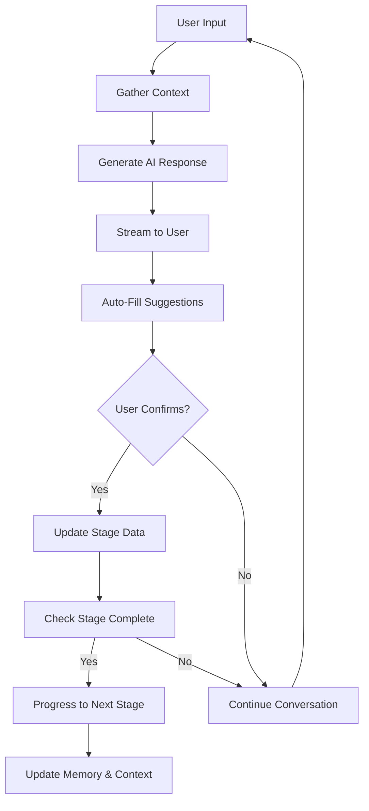

# Chargur AI Agent System

## Overview

The Chargur AI Agent is the intelligent core of our UX design and app architecture planning platform. It acts as a conversational AI assistant that guides users through the entire app development process, from initial ideation to final export-ready specifications.

## Architecture

### Core Components

1. **AgentContextProvider** (`src/components/agent/AgentContextProvider.tsx`)
   - Manages global agent state and memory
   - Provides cross-stage intelligence and recommendations
   - Handles persistent learning and context retention

2. **Canvas Integration** (`src/components/layout/Canvas.tsx`)
   - Main interface for user-agent interaction
   - Handles streaming responses and auto-fill confirmations
   - Manages stage progression and completion

3. **Edge Function** (`supabase/functions/agent-prompt/index.ts`)
   - Processes agent requests with full context
   - Integrates with LLM APIs (OpenAI, Claude, etc.)
   - Returns structured responses with auto-fill data

4. **Spatial Canvas** (`src/components/canvas/SpatialCanvas.tsx`)
   - Visual representation of project data
   - Dynamically updates based on agent interactions
   - Shows relationships between different project elements

## Agent Workflow

### 1. User Input Processing
```
User Message → Agent Context → Edge Function → LLM API → Structured Response
```

### 2. Agentic Loop (Per Stage)


### 3. Cross-Stage Intelligence
The agent maintains awareness across all stages:
- **Memory Persistence**: Stores decisions and context from previous stages
- **Recommendation Engine**: Suggests features/options based on earlier choices
- **Dependency Detection**: Warns about missing requirements or conflicts
- **Progressive Enhancement**: Builds upon previous work intelligently

## Stage-Specific Behaviors

### 1. Ideation & Discovery
- **Triggers**: "I want to build an app about...", "Create an app for..."
- **Auto-Fill**: App name, problem statement, initial target users
- **Completion**: App idea, name, problem, and value proposition defined

### 2. Feature Planning
- **Cross-Stage Logic**: Analyzes app idea to suggest relevant feature packs
- **Auto-Fill**: Feature pack selections, custom features, priorities
- **Intelligence**: Recommends features based on app category and target users

### 3. Structure & Flow
- **Dependencies**: Uses selected features to generate screen structure
- **Auto-Fill**: Screen hierarchy, user flows, navigation patterns
- **Architecture Prep**: Component structure and data models

### 4. Interface & Interaction
- **Context-Aware**: Suggests design systems based on app type
- **Auto-Fill**: Design system, brand colors, interaction patterns
- **UX Intelligence**: Mobile-first recommendations for mobile-targeted apps

### 5. Architecture Design
- **Technical Generation**: Database schema, API endpoints, file structure
- **Auto-Fill**: Complete technical specifications
- **Integration Planning**: Environment variables and third-party services

### 6. User & Auth Flow
- **Security Intelligence**: Recommends auth methods based on app features
- **Auto-Fill**: Authentication setup, user roles, security features
- **Compliance**: Suggests security measures for e-commerce/social features

## Memory & Learning System

### Agent Memory Structure
```typescript
interface AgentMemory {
  stageId: string;
  interactions: {
    userInput: string;
    agentResponse: string;
    autoFillApplied: any;
    timestamp: string;
  }[];
  crossStageInsights: string[];
  learningData: {
    userPreferences: any;
    commonPatterns: any;
    successfulSuggestions: any;
  };
}
```

### Cross-Stage Intelligence Examples

1. **App Category → Feature Suggestions**
   - Social app → Social + Communication feature packs
   - E-commerce → Commerce + Auth + Analytics
   - Educational → Auth + Media + Analytics

2. **Target Users → UX Decisions**
   - Mobile users → Mobile-first design recommendations
   - Business users → Professional design system suggestions
   - Young users → Modern, playful interface suggestions

3. **Feature Dependencies → Security Requirements**
   - E-commerce features → Enhanced security (2FA, rate limiting)
   - Social features → Content moderation roles
   - File uploads → Storage configuration warnings

## Auto-Fill & Confirmation System

### Auto-Fill Process
1. **Detection**: Agent identifies opportunities to pre-fill form fields
2. **Generation**: Creates structured data matching form schema
3. **Confirmation**: User reviews and approves suggestions
4. **Application**: Data is merged into stage configuration
5. **Memory Update**: Successful auto-fills are remembered for future use

### Confirmation UI
- Modal dialog showing proposed changes
- Field-by-field preview of auto-fill data
- Accept/Reject options with explanations
- Undo capability for applied changes

## Stage Completion & Progression

### Completion Detection
The agent determines stage completion based on:
- **Required Fields**: All mandatory fields have values
- **Quality Threshold**: Content meets minimum quality standards
- **User Confirmation**: User explicitly indicates readiness to proceed
- **Cross-Stage Validation**: No conflicts with previous stages

### Automatic Progression
When a stage is complete:
1. Mark current stage as completed
2. Unlock next stage (if not coming soon)
3. Automatically navigate to next stage
4. Provide transition context to maintain continuity
5. Update agent memory with completion data

## Integration Points

### LLM Integration
```typescript
// Environment Variables Required
OPENAI_API_KEY=your_openai_key
ANTHROPIC_API_KEY=your_claude_key
SUPABASE_URL=your_supabase_url
SUPABASE_SERVICE_ROLE_KEY=your_service_key
```

### Prompt Engineering
Each stage has specialized prompts that:
- Define the agent's role and capabilities
- Provide full context from all previous stages
- Specify desired output format and structure
- Include examples of successful interactions
- Guide the LLM to generate actionable suggestions

### Error Handling & Resilience
- **Retry Logic**: Automatic retries for API failures
- **Fallback Responses**: Graceful degradation when LLM unavailable
- **Rate Limiting**: Respect API limits and user quotas
- **Circuit Breaker**: Temporary disable on repeated failures
- **User Feedback**: Clear error messages and recovery options

## Security & Privacy

### Data Protection
- **No Persistent Storage**: User data not stored in LLM provider systems
- **Secure Transmission**: All API calls use HTTPS and proper authentication
- **Local Memory**: Agent memory stored locally in browser
- **Anonymization**: Personal data stripped from LLM requests when possible

### API Key Management
- **Environment Variables**: All keys stored securely in Supabase
- **Edge Function Only**: Keys never exposed to client-side code
- **Rotation Support**: Easy key rotation without code changes
- **Audit Logging**: Track API usage and potential security issues

## Performance Optimization

### Streaming Responses
- **Real-time Feedback**: Users see responses as they're generated
- **Reduced Latency**: Perceived performance improvement
- **Cancellation Support**: Users can interrupt long responses
- **Progressive Enhancement**: Basic functionality works without streaming

### Caching Strategy
- **Response Caching**: Cache common responses for faster delivery
- **Context Compression**: Optimize context size for API efficiency
- **Memory Optimization**: Prune old memory data to prevent bloat
- **Lazy Loading**: Load agent components only when needed

## Development & Testing

### Local Development
1. Set up Supabase project with Edge Functions
2. Configure environment variables
3. Test with mock LLM responses
4. Gradually integrate real LLM APIs

### Testing Strategy
- **Unit Tests**: Individual agent functions and utilities
- **Integration Tests**: Full agent workflow with mock APIs
- **E2E Tests**: Complete user journeys through all stages
- **Performance Tests**: Response time and memory usage
- **Security Tests**: API key protection and data handling

### Monitoring & Analytics
- **Usage Metrics**: Track agent interactions and success rates
- **Performance Monitoring**: Response times and error rates
- **User Feedback**: Collect ratings on agent helpfulness
- **A/B Testing**: Test different prompt strategies and UI patterns

## Future Enhancements

### Advanced Features
- **Multi-Modal Input**: Support for images, sketches, and voice
- **Collaborative Editing**: Multiple users working with same agent
- **Template Learning**: Agent learns from successful project patterns
- **Export Integration**: Direct integration with development tools
- **Version Control**: Track changes and allow rollbacks

### AI Capabilities
- **Specialized Models**: Fine-tuned models for specific domains
- **Multi-Agent Systems**: Specialized agents for different stages
- **Predictive Analytics**: Anticipate user needs and suggest improvements
- **Quality Assurance**: Automated review and validation of outputs
- **Continuous Learning**: Improve responses based on user feedback

## Conclusion

The Chargur AI Agent represents a sophisticated approach to AI-assisted UX design and app planning. By combining conversational AI with structured workflows, cross-stage intelligence, and user-friendly interfaces, it transforms the complex process of app development planning into an intuitive, guided experience.

The system is designed to be:
- **Intelligent**: Learns from user interactions and provides contextual suggestions
- **Flexible**: Adapts to different app types and user preferences
- **Reliable**: Handles errors gracefully and provides consistent experiences
- **Scalable**: Can be extended with new stages, features, and AI capabilities
- **Secure**: Protects user data and API credentials throughout the process

This foundation enables rapid prototyping and planning while maintaining the depth and rigor required for successful app development projects.