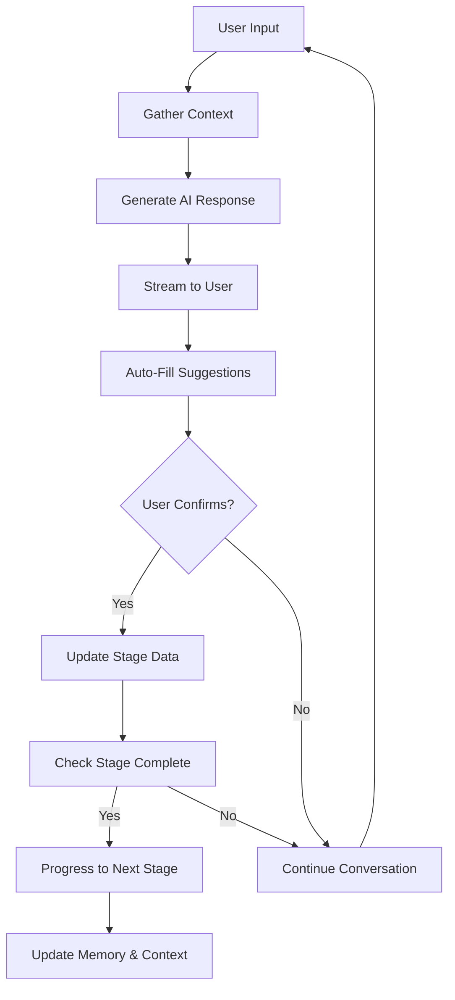

# Chargur AI Agent System

## Overview

The Chargur AI Agent is the intelligent core of our UX design and app architecture planning platform. It acts as a conversational AI assistant that guides users through the entire app development process, from initial ideation to final export-ready specifications.

## Architecture

### Core Components

1. **AgentContextProvider** (`src/components/agent/AgentContextProvider.tsx`)
   - Manages global agent state and memory
   - Provides cross-stage intelligence and recommendations
   - Handles persistent learning and context retention

2. **Canvas Integration** (`src/components/layout/Canvas.tsx`)
   - Main interface for user-agent interaction
   - Handles streaming responses and auto-fill confirmations
   - Manages stage progression and completion

3. **Prompt Engineering System** (`src/lib/prompts/stagePrompts.ts`)
   - Stage-specific prompt generation with context awareness
   - Structured response formatting and validation
   - Cross-stage intelligence and recommendation logic

4. **LLM Client** (`src/lib/llm/llmClient.ts`)
   - Multi-provider LLM integration (OpenAI, Anthropic)
   - Robust error handling and retry mechanisms
   - Streaming response support and token management

5. **Edge Function** (`supabase/functions/agent-prompt/index.ts`)
   - Enhanced LLM integration with proper prompt engineering
   - Structured response parsing and validation
   - Advanced error handling and fallback mechanisms

6. **Spatial Canvas** (`src/components/canvas/SpatialCanvas.tsx`)
   - Visual representation of project data
   - Dynamically updates based on agent interactions
   - Shows relationships between different project elements

## Agent Workflow

### 1. User Input Processing
```
User Message → Agent Context → Edge Function → LLM API → Structured Response
```

### 2. Agentic Loop (Per Stage)


### 3. Cross-Stage Intelligence
The agent maintains awareness across all stages:
- **Memory Persistence**: Stores decisions and context from previous stages
- **Recommendation Engine**: Suggests features/options based on earlier choices
- **Dependency Detection**: Warns about missing requirements or conflicts
- **Progressive Enhancement**: Builds upon previous work intelligently

## Robust Prompt Engineering

### Stage-Specific Prompt Architecture
Each stage has carefully crafted prompts that include:

1. **Role Definition**: Clear AI persona and responsibilities
2. **Context Integration**: Full project history and cross-stage data
3. **Response Structure**: Exact JSON format specifications
4. **Auto-Fill Logic**: Intelligent data extraction and suggestion rules
5. **Completion Criteria**: Clear stage completion requirements

### Prompt Engineering Principles

1. **Specificity**: Detailed technical requirements and constraints
2. **Context Awareness**: Integration of all previous stage data
3. **Structured Output**: Consistent JSON response format
4. **Error Resilience**: Fallback responses for parsing failures
5. **Cross-Stage Intelligence**: Smart recommendations based on project evolution

### Example Prompt Structure
```typescript
{
  systemPrompt: `You are an expert UX strategist...
    CORE RESPONSIBILITIES: [detailed list]
    CROSS-STAGE CONTEXT: [previous stage data]
    AUTO-FILL OPPORTUNITIES: [specific extraction rules]
    COMPLETION CRITERIA: [clear requirements]`,
  
  userPrompt: `User message: "${userMessage}"
    Respond in this exact JSON format: {...}`,
  
  temperature: 0.7,
  maxTokens: 1000
}
```

## Stage-Specific Behaviors

### 1. Ideation & Discovery
- **Prompt Focus**: Extract app concepts from natural language
- **Auto-Fill Logic**: App name generation, problem identification, user segmentation
- **Cross-Stage Prep**: Foundation data for all subsequent stages
- **Completion Criteria**: App idea, name, problem statement, target users, value proposition

### 2. Feature Planning
- **Prompt Focus**: Strategic feature selection and prioritization
- **Cross-Stage Intelligence**: App concept → Feature pack mapping
- **Auto-Fill Logic**: MoSCoW prioritization, MVP feature selection
- **Dependency Detection**: Feature conflicts and requirements

### 3. Structure & Flow
- **Prompt Focus**: Information architecture and user journey design
- **Cross-Stage Intelligence**: Features → Screen structure generation
- **Auto-Fill Logic**: Navigation patterns, data model inference
- **Flow Optimization**: User journey mapping and task flow design

### 4. Interface & Interaction
- **Prompt Focus**: Visual design and interaction specification
- **Cross-Stage Intelligence**: App type → Design system recommendations
- **Auto-Fill Logic**: Brand color psychology, typography selection
- **Responsive Design**: Mobile-first approach based on target users

### 5. Architecture Design
- **Prompt Focus**: Technical architecture and system design
- **Cross-Stage Intelligence**: Features → Database schema generation
- **Auto-Fill Logic**: API endpoint planning, integration requirements
- **Scalability Planning**: Performance and growth considerations

### 6. User & Auth Flow
- **Prompt Focus**: Security architecture and user management
- **Cross-Stage Intelligence**: Features → Security requirements mapping
- **Auto-Fill Logic**: Auth method selection, role-based permissions
- **Compliance Awareness**: GDPR, security best practices

### 7. UX Review & User Check
- **Prompt Focus**: Comprehensive quality assessment and gap analysis
- **Cross-Stage Intelligence**: Holistic project validation
- **Auto-Fill Logic**: Completion scoring, inconsistency detection
- **Quality Metrics**: Readiness assessment and improvement recommendations

### 8. Auto-Prompt Engine
- **Prompt Focus**: Development-ready prompt generation
- **Cross-Stage Intelligence**: Complete project → Bolt.new prompts
- **Auto-Fill Logic**: Technical specification compilation
- **Code Generation**: Optimized prompts for AI development tools

### 9. Export & Handoff
- **Prompt Focus**: Professional deliverable preparation
- **Cross-Stage Intelligence**: Complete documentation generation
- **Auto-Fill Logic**: Multi-format export packages
- **Quality Assurance**: Handoff checklists and maintenance guides

## Memory & Learning System

### Agent Memory Structure
```typescript
interface AgentMemory {
  stageId: string;
  interactions: {
    userInput: string;
    agentResponse: string;
    autoFillApplied: any;
    timestamp: string;
  }[];
  crossStageInsights: string[];
  learningData: {
    userPreferences: any;
    commonPatterns: any;
    successfulSuggestions: any;
  };
}
```

### Cross-Stage Intelligence Examples

1. **App Category → Feature Suggestions**
   - Social app → Social + Communication feature packs
   - E-commerce → Commerce + Auth + Analytics
   - Educational → Auth + Media + Analytics

2. **Target Users → UX Decisions**
   - Mobile users → Mobile-first design recommendations
   - Business users → Professional design system suggestions
   - Young users → Modern, playful interface suggestions

3. **Feature Dependencies → Security Requirements**
   - E-commerce features → Enhanced security (2FA, rate limiting)
   - Social features → Content moderation roles
   - File uploads → Storage configuration warnings

## Auto-Fill & Confirmation System

### Auto-Fill Process
1. **Detection**: Agent identifies opportunities to pre-fill form fields
2. **Generation**: Creates structured data matching form schema
3. **Confirmation**: User reviews and approves suggestions
4. **Application**: Data is merged into stage configuration
5. **Memory Update**: Successful auto-fills are remembered for future use

### Confirmation UI
- Modal dialog showing proposed changes
- Field-by-field preview of auto-fill data
- Accept/Reject options with explanations
- Undo capability for applied changes

## Stage Completion & Progression

### Completion Detection
The agent determines stage completion based on:
- **Required Fields**: All mandatory fields have values
- **Quality Threshold**: Content meets minimum quality standards
- **User Confirmation**: User explicitly indicates readiness to proceed
- **Cross-Stage Validation**: No conflicts with previous stages

### Automatic Progression
When a stage is complete:
1. Mark current stage as completed
2. Unlock next stage (if not coming soon)
3. Automatically navigate to next stage
4. Provide transition context to maintain continuity
5. Update agent memory with completion data

## Integration Points

### LLM Integration
```typescript
// Environment Variables Required
OPENAI_API_KEY=your_openai_key
ANTHROPIC_API_KEY=your_claude_key
SUPABASE_URL=your_supabase_url
SUPABASE_SERVICE_ROLE_KEY=your_service_key
```

### Multi-Provider LLM Support
The system supports multiple LLM providers with automatic fallback:

1. **Primary**: OpenAI GPT-4 Turbo (default)
2. **Fallback**: Anthropic Claude 3 Sonnet
3. **Error Handling**: Graceful degradation with retry logic
4. **Response Validation**: Structured JSON parsing with fallbacks

### Prompt Optimization Features

1. **Context Compression**: Efficient token usage while maintaining quality
2. **Response Caching**: Cache common responses for faster delivery
3. **Temperature Control**: Stage-appropriate creativity vs. consistency
4. **Token Management**: Optimal token allocation per stage
5. **Streaming Support**: Real-time response delivery

### Error Handling & Resilience

1. **Multi-Level Retry**: Exponential backoff with intelligent retry logic
2. **Provider Fallback**: Automatic switching between LLM providers
3. **Response Validation**: JSON parsing with error recovery
4. **Graceful Degradation**: Functional responses even with API failures
5. **User Communication**: Clear error messages and recovery guidance

### Response Quality Assurance

1. **Structured Validation**: Ensure all required fields are present
2. **Content Quality**: Validate response relevance and completeness
3. **Auto-Fill Validation**: Verify auto-fill data matches form schemas
4. **Cross-Stage Consistency**: Ensure recommendations align with project data
5. **Fallback Content**: High-quality fallback responses for edge cases

## Security & Privacy

### Data Protection
- **No Persistent Storage**: User data not stored in LLM provider systems
- **Secure Transmission**: All API calls use HTTPS and proper authentication
- **Local Memory**: Agent memory stored locally in browser
- **Anonymization**: Personal data stripped from LLM requests when possible

### API Key Management
- **Environment Variables**: All keys stored securely in Supabase
- **Edge Function Only**: Keys never exposed to client-side code
- **Rotation Support**: Easy key rotation without code changes
- **Audit Logging**: Track API usage and potential security issues

## Performance Optimization

### Streaming Responses
- **Real-time Feedback**: Users see responses as they're generated
- **Reduced Latency**: Perceived performance improvement
- **Cancellation Support**: Users can interrupt long responses
- **Progressive Enhancement**: Basic functionality works without streaming

### Caching Strategy
- **Response Caching**: Cache common responses for faster delivery
- **Context Compression**: Optimize context size for API efficiency
- **Memory Optimization**: Prune old memory data to prevent bloat
- **Lazy Loading**: Load agent components only when needed

## Development & Testing

### Local Development
1. Set up Supabase project with Edge Functions
2. Configure environment variables
3. Install dependencies: `npm install`
4. Start development server: `npm run dev`
5. Test with mock responses first, then integrate real LLM APIs

### Testing Strategy

1. **Prompt Testing**: Validate prompt generation for all stages
2. **LLM Integration**: Test with multiple providers and error scenarios
3. **Response Parsing**: Validate JSON parsing and fallback mechanisms
4. **Cross-Stage Logic**: Test intelligence and recommendation systems
5. **User Workflows**: End-to-end testing of complete user journeys
6. **Performance**: Response time, token usage, and memory optimization
7. **Security**: API key protection and data handling validation

### Monitoring & Analytics

1. **Prompt Performance**: Track success rates by stage and prompt version
2. **LLM Metrics**: Monitor token usage, response times, and error rates
3. **User Satisfaction**: Collect feedback on agent helpfulness and accuracy
4. **Cross-Stage Intelligence**: Measure recommendation acceptance rates
5. **Quality Metrics**: Track auto-fill accuracy and stage completion rates
6. **A/B Testing**: Test different prompt strategies and response formats

## Future Enhancements

### Advanced Features

1. **Advanced Prompt Engineering**: Dynamic prompt generation based on user patterns
2. **Multi-Modal Input**: Support for images, sketches, and voice input
3. **Collaborative Intelligence**: Multiple users working with shared agent context
4. **Template Learning**: Agent learns from successful project patterns
5. **Real-Time Collaboration**: Live editing with multiple stakeholders
6. **Version Control**: Track changes and allow rollbacks across stages

### AI Capabilities

1. **Fine-Tuned Models**: Domain-specific models for UX design and architecture
2. **Multi-Agent Systems**: Specialized agents for different design disciplines
3. **Predictive Intelligence**: Anticipate user needs and suggest improvements
4. **Quality Assurance**: Automated review and validation of design decisions
5. **Continuous Learning**: Improve responses based on user feedback and outcomes
6. **Code Generation**: Direct integration with development tools and frameworks

## Conclusion

The Chargur AI Agent represents a sophisticated approach to AI-assisted UX design and app planning. By combining advanced prompt engineering, multi-provider LLM integration, and intelligent cross-stage reasoning, it transforms the complex process of app development planning into an intuitive, guided experience.

The system is designed to be:
- **Intelligent**: Advanced prompt engineering provides contextual, high-quality responses
- **Reliable**: Multi-provider support with robust error handling and fallback mechanisms
- **Scalable**: Modular architecture supports new stages, features, and AI capabilities
- **Secure**: Comprehensive security measures protect user data and API credentials
- **Performant**: Optimized for speed, token efficiency, and user experience

This robust foundation enables rapid prototyping and planning while maintaining the depth, accuracy, and rigor required for successful app development projects. The system's advanced prompt engineering ensures that each interaction is meaningful, contextual, and progressively builds toward a complete, development-ready specification.